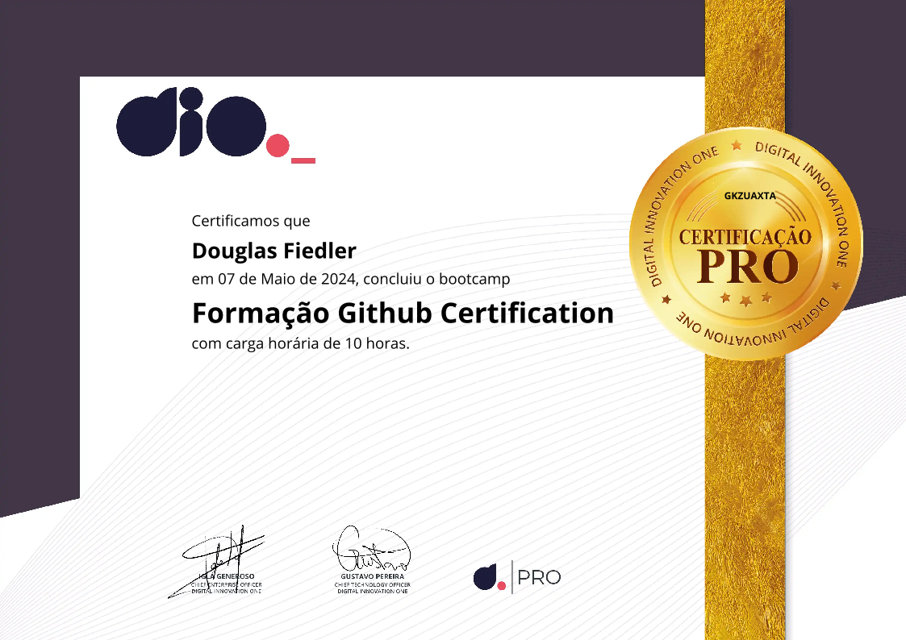
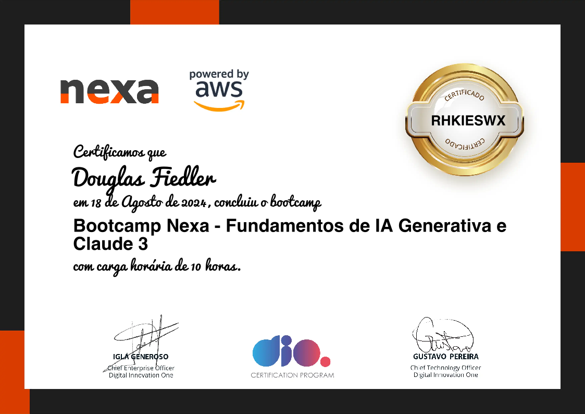

# MyLearningVoyages

## Bem-vindo ao repositório MyLearningVoyages! 🌍✨

Este repositório serve como um diário de bordo da minha jornada contínua de aprendizado. Aqui você encontrará uma coleção de cursos, exercícios e projetos que desenvolvi neste período, abrangendo diversas áreas e tecnologias.

## 🎯 Objetivo
O objetivo principal deste repositório é documentar e compartilhar meu progresso no mundo da tecnologia, ajudando-me a divulgar e relembrar os cursos que realizei e conceitos aprendidos além de contribuir para a comunidade de desenvolvedores e entusiastas.

## 📄 Conteúdo
O repositório está estruturado da seguinte forma:

- **Providers:** Diretório contendo as instituições de ensino

- **"Provider-name":** Diretório da instituição de ensino contendo os cursos realizados.

- **"Course-name":** Diretório contendo os exercícios que completei ou estou realizando e certificados obtidos. Dentro de cada pasta de exercícios do curso, você encontrará materiais de estudo, anotações e atividades práticas.

## 📚 Cursos

### 🛠️ Essenciais

- [Formação Github Certification](providers/dio/formacao-github-certification/)

### 🤖 IA

- [Bootcamp Nexa - Fundamentos de IA Generativa e Claude 3](providers/dio/bootcamp-nexa-fundamentos-de-ia-generativa-e-claude-3)

## 🎓 Certificados

### 🛠️ Essenciais

### 🤖 IA

## 🚀 Como Contribuir
Se você encontrou algum erro, ou gostaria de sugerir melhorias, fique à vontade para abrir uma issue.

## 📄 Licença
Este repositório é licenciado sob a MIT License.